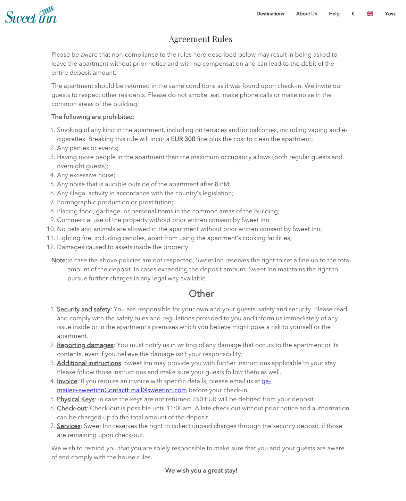

<style>
.responsive-video {
    position: relative;
    padding-bottom: 56.25%; /* Aspect ratio for 16:9 videos */
    padding-top: 30px;
    height: 0;
    overflow: hidden;
}

.responsive-video iframe,
.responsive-video object,
.responsive-video embed {
    position: absolute;
    top: 0;
    left: 0;
    width: 100%;
    height: 100%;
}
</style>

# CMS - House Rules Manager <span class="label label-yellow">Comming Soon</span>

The House Rules manager allows you to customize your city's house rules.
To allow that we implemented a markdown editor that will help you achieve the desired result.
Read more about [markdown](https://www.markdownguide.org/cheat-sheet/)

For example to achieve the current House Rules that shown by default on the website,



You can use the following snippet

```
# **<center>Agreement Rules</center>**

Please be aware that non-compliance to the rules here described below may result in being asked to leave the apartment without prior notice and with no compensation and can lead to the debit of the entire deposit amount.

The apartment should be returned in the same conditions as it was found upon check-in. We invite our guests to respect other residents. Please do not smoke, eat, make phone calls or make noise in the common areas of the building.

**The following are prohibited:**

1. Smoking of any kind in the apartment, including on terraces and/or balconies, including vaping and e-cigarettes. Breaking this rule will incur a EUR 300 fine plus the cost to clean the apartment;
2. Any parties or events;
3. Having more people in the apartment than the maximum occupancy allows (both regular guests and overnight guests);
4. Any excessive noise;
5. Any noise that is audible outside of the apartment after 8 PM;
6. Any illegal activity in accordance with the country's legislation;
7. Pornographic production or prostitution;
8. Placing food, garbage, or personal items in the common areas of the building;
9. Commercial use of the property without prior written consent by Sweet Inn
10. No pets and animals are allowed in the apartment without prior written consent by Sweet Inn;
11. Lighting fire, including candles, apart from using the apartment's cooking facilities;
12. Damages caused to assets inside the property

**Note**:
in case the above policies are not respected, Sweet Inn reserves the right to set a fine up to the total amount of the deposit. In cases exceeding the deposit amount, Sweet Inn maintains the right to pursue further charges in any legal way available.

# **<center>Other</center>**
1. <u> **Security and safety**</u>: You are responsible for your own and your guests' safety and security. Please read and comply with the safety rules and regulations provided to you and inform us immediately of any issue inside or in the apartment's premises which you believe might pose a risk to yourself or the apartment.
2. **<u>Reporting damages</u>**: You must notify us in writing of any damage that occurs to the apartment or its contents, even if you believe the damage isn't your responsibility.
3. **<u>Additional instructions</u>**: Sweet Inn may provide you with further instructions applicable to your stay. Please follow those instructions and make sure your guests follow them as well.
4. **<u>Invoice</u>**: If you require an invoice with specific details, please email us at [qa-mailer+sweetinnContactEmail@sweetinn.com ](mailto:qa-mailer+sweetinnContactEmail@sweetinn.com ) efore your check-in.
5. **<u>Physical Keys</u>**: In case the keys are not returned 250 EUR will be debited from your deposit.
6. **<u>Check-out</u>**: Check-out is possible until 11:00am. A late check out without prior notice and authorization can be charged up to the total amount of the deposit.
7. **<u>Services</u>**: Sweet Inn reserves the right to collect unpaid charges through the security deposit, if those are remaining upon check-out.

We wish to remind you that you are solely responsible to make sure that you and your guests are aware of and comply with the house rules.

**<center>We wish you a greate stay!</center>**
```


<!-- <div class="responsive-video">
    <iframe src="https://www.youtube.com/embed/missing_link" frameborder="0" allowfullscreen></iframe>
</div> -->