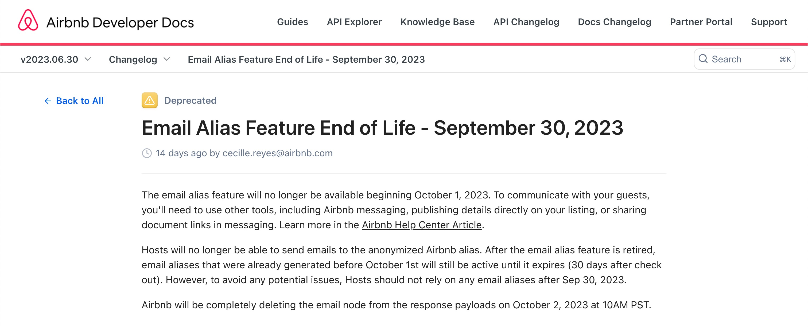

# Version 45A

### Updates on Airbnb Email Alias Changes

As of September 30, 2023, Airbnb has announced that new reservations will no longer come with an alias email address.[Read More](https://www.airbnb.ie/resources/hosting-homes/a/an-update-for-hosts-who-use-the-email-alias-feature-195?locale=en&_set_bev_on_new_domain=1641815811_MTI5ZGE1NTg5NTA5)

Following those changes, we’ve acted as so:

#### <u>Online Check-in</u>
- For Airbnb guests: The verification code for the initial step of the Online Check-In is now dispatched via Airbnb messaging.

- For guests not booked through Airbnb: The process remains unchanged, with the verification code sent via email. 

#### <u>Journeys</u>
- For Airbnb reservations: The confirmation email won't be dispatched since there's no recipient email address.
Instead, a confirmation text message will be relayed to the Airbnb platform.
(This feature necessitates an active Unified Inbox connection.)

#### <u>Want to manually resend the confirmation email?</u>
After appending an email to the reservation, you can trigger the re-send confirmation email function in SIBO.
Guests can provide an email either via the online check-in page OR agents can directly update it on SIBO’s booking detail page.
